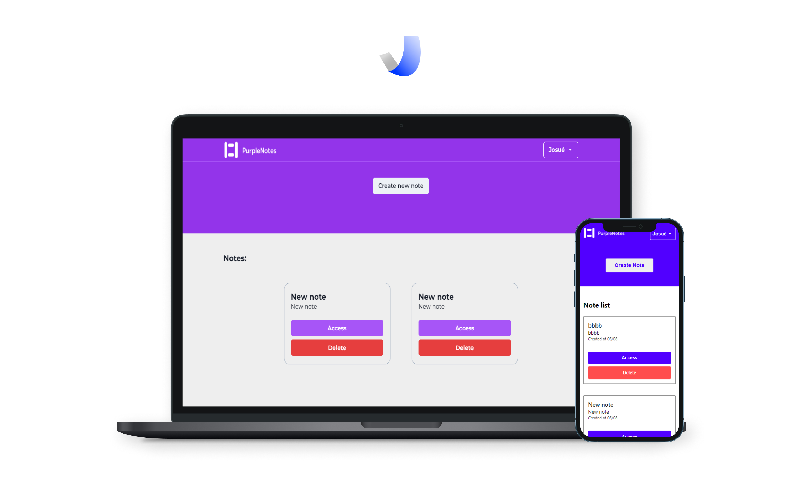
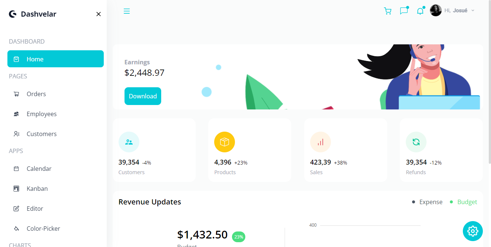
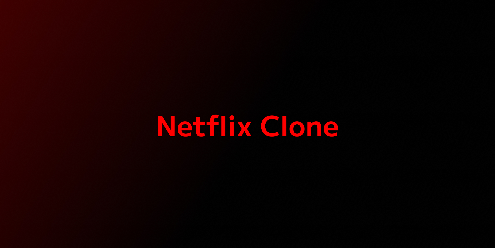
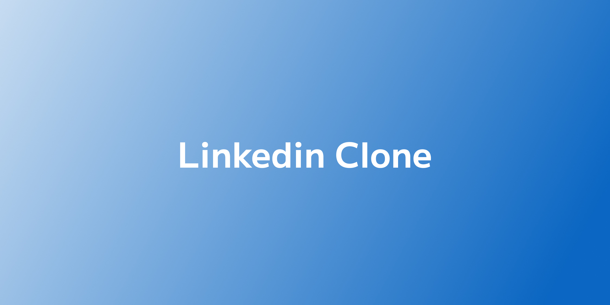

### Hello, I'm Josué Mendonça 👽

    

        <strong>Technologies</strong>: 
        
            HTML, CSS, SASS, Bootstrap, Javascript, Typescript, React, Next.js, Chakra-UI, Tailwind, Node.js, Express, MongoDB, MySQL, TypeORM, basics of React Native 0.69.5 with Expo 46, Native-Base
        
    

    

        <strong>Tools</strong>: 
        
            VS Code, Git, Figma
        
    

    

        <strong>Learning</strong>: 
        Improving what I already know
    

     
    

    

<h1 align="center">Selected projects</h1>
<table border bordercolor="#505050" width="100%">

<tr>
<td wdith="50%" valign="top">

<h3 align="center">Purple Notes</h3>

 

 

  

It is a full-stack note-taking application. You can access it from anywhere because everything is saved in the cloud!

</td>

<td wdith="50%" valign="top">

<h3 align="center">Dashvelar</h3>

 

 

  

Beautiful dashboard made in a fully productive way, the components are functional and responsive!

</td>
</tr>

<tr>
<td wdith="50%" valign="top">

<h3 align="center">Netflix Clone</h3>

 

 

  

This application is a clone of Linkedin, React and firebase were used

</td>

<td wdith="50%" valign="top">

<h3 align="center">Linkedin Clone</h3>

 

 

  

Beautiful dashboard made in a fully productive way, the components are functional and responsive!

</td>
</tr>

</table>

 
 

