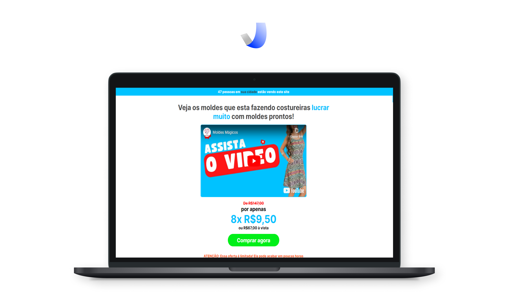

### Hello, I'm Josué Mendonça 👽

    

        <strong>Technologies</strong>: 
        
            HTML, CSS, SASS, Bootstrap, Javascript, Typescript, React, Next.js, Chakra-UI, Tailwind, Node.js, Express, MongoDB, MySQL, TypeORM, basics of React Native 0.69.5 with Expo 46, Native-Base, Electron, GIT
        
    

    

        <strong>Tools</strong>: 
        
            VS Code, Git, Figma
        
    

    

        <strong>Learning</strong>: 
        Electron, Jest on backend
    

     
    

    

<h1 align="center">Selected projects</h1>
<table border bordercolor="#505050" width="100%">

<tr>
<td wdith="50%" valign="top">

<h3 align="center">Savage Servidores</h3>

 

 

Private Repo

It is an application made to accommodate players looking for a great CSGO server. As the page's audience is younger, I focused on leaving a modern and simple design at the same time. Also the client opted to have SEO i.e. I needed to use Next.js because it fit the requirement so well.

</td>

<td wdith="50%" valign="top">

<h3 align="center">Moldes Mágicos</h3>

 

 

  

This was a landing page focused on selling to an older audience, so the focus was on making something simple. Currently the info-producer of this product is making a great profit

</td>
</tr>

<tr>
<td wdith="50%" valign="top">

<h3 align="center">Pacote de Moldes</h3>

 

 

  

This Landing Page was focused on low price sales, and the target audience was the elderly, so the focus was on simplicity but without giving up a touch of modernity as the customer asked

</td>

<td wdith="50%" valign="top">

<h3 align="center">Purple Notes</h3>

 

 

  

It is a full-stack note-taking application. You can access it from anywhere because everything is saved in the cloud!

</td>
</tr>

</table>

 
 

