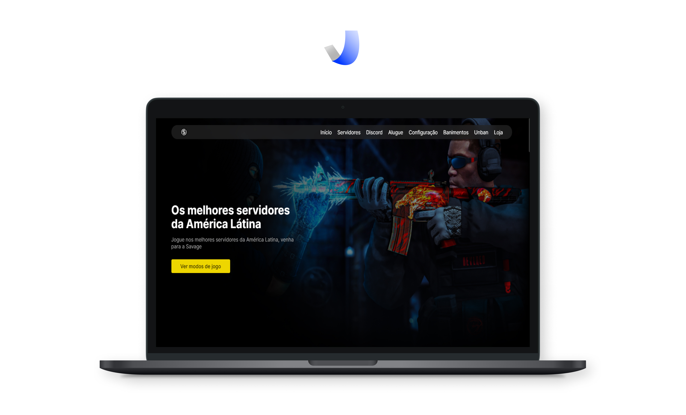

  

### Hello, I'm Josué Mendonça 👽

    

        <strong>Languages</strong>: 
        
            Javascript, Typescript, PHP
        
    

    

        <strong>Frontend</strong>: 
        
            HTML, CSS, SASS, React, jQuery, Bootstrap (4,5), Tailwind, React Native, Expo, Electron
        
    

    

        <strong>Backend</strong>: 
        
            PHP, Laravel, Node.js, Nest.js, TypeORM, Next.js, MySQL, MongoDB
        
    

    

        <strong>Versioning</strong>: 
        
            GIT
        
    

    

        <strong>Tools</strong>: 
        
            VS Code, Git, Figma
        
    

     

        <strong>DevOps</strong>: 
        
            JIRA, Docker
        
    

 
    

<h1 align="center">Selected projects</h1>
<table border bordercolor="#505050" width="100%">

<tr>
<td wdith="50%" valign="top">

<h3 align="center">Gerador de PIX - ValidaPix</h3>

 

 

Private Repo

Web application is a Brazilian PIX payment generator that allows users to easily create QR codes and copy-and-paste payment information for instant transactions.

</td>

<td wdith="50%" valign="top">

<h3 align="center">ValidaPix</h3>

 

 

Private Repo

This landing page was made for ValidaPix, which is a company that brings pix validation (Brazilian instant payment method) in a simple and modern way. I developed from the MVP of the dashboard and now the landing page.

</td>

</tr>

<tr>
<td wdith="50%" valign="top">

<h3 align="center">Savage Servidores</h3>

 

 

Private Repo

It is an application made to accommodate players looking for a great CSGO server. As the page's audience is younger, I focused on leaving a modern and simple design at the same time. Also the client opted to have SEO i.e. I needed to use Next.js because it fit the requirement so well.

</td>

<td wdith="50%" valign="top">

<h3 align="center">Pacote de Moldes</h3>

 

 

  

This Landing Page was focused on low price sales, and the target audience was the elderly, so the focus was on simplicity but without giving up a touch of modernity as the customer asked

</td>

</tr>

</table>

